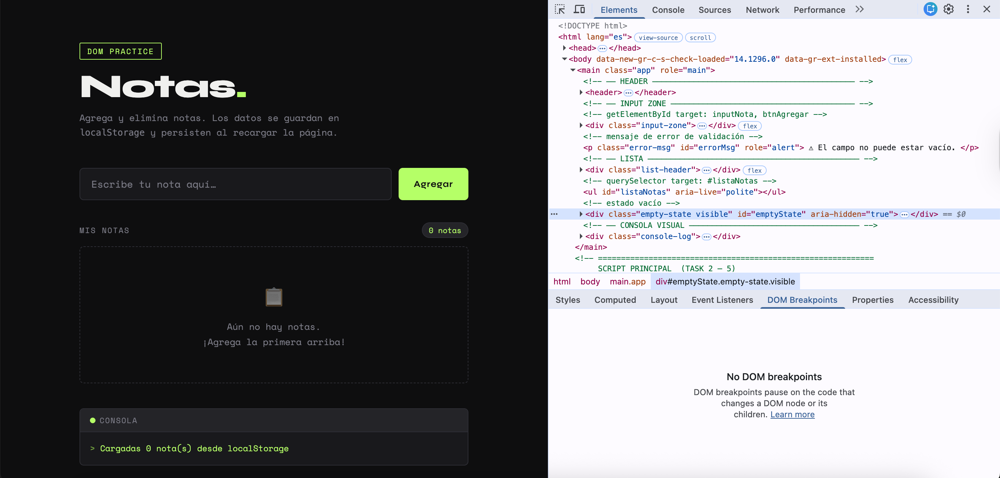
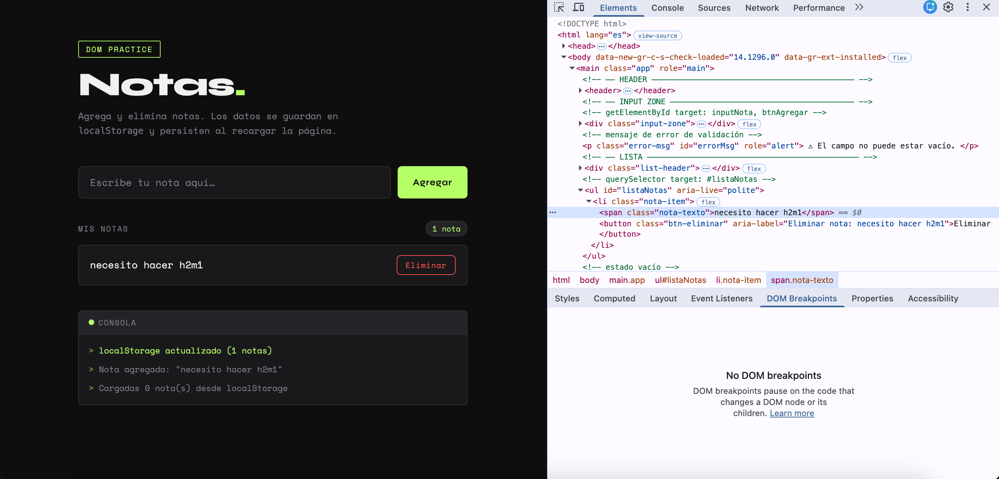
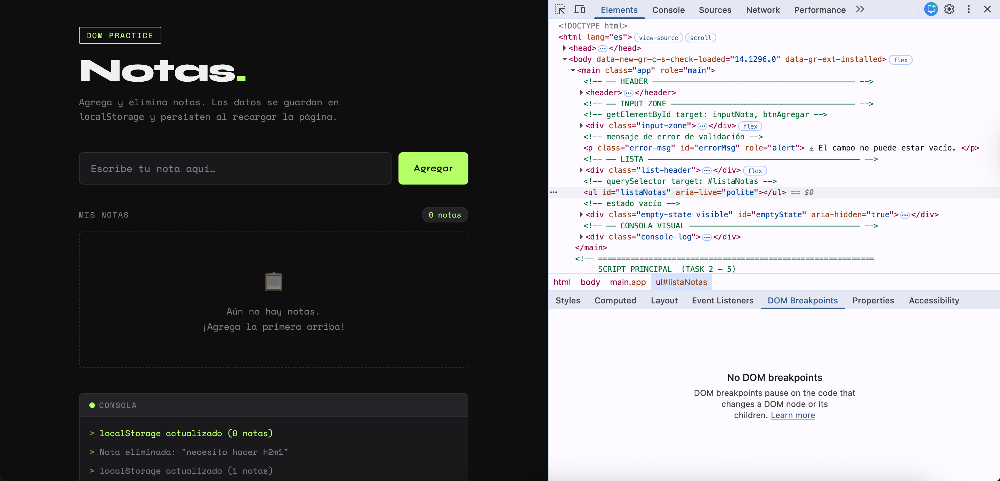
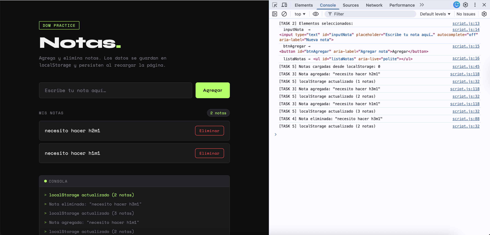
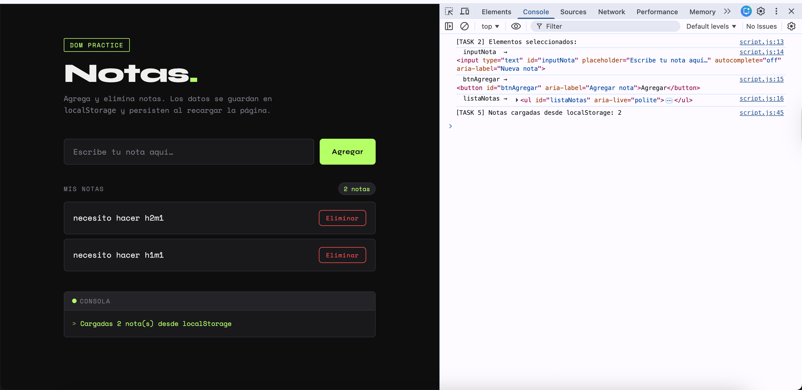
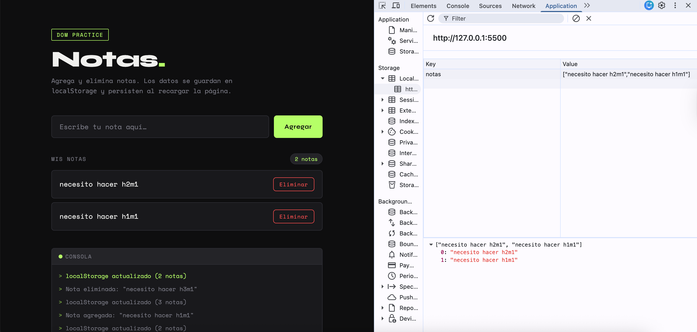
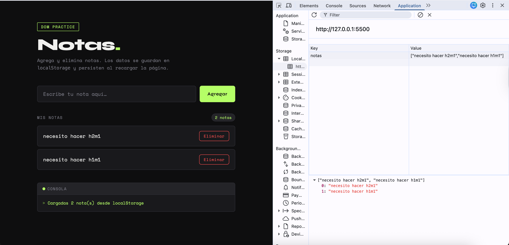

# Notes List · DOM Practice

A mini notes app built with HTML, CSS and vanilla JavaScript as a DOM manipulation and `localStorage` persistence exercise.
- [See README in Spanish](README.es.md)

---

## Goal

Practice native browser APIs to:

- Select DOM elements with `getElementById` and `querySelector`
- Dynamically create, insert and remove nodes with `createElement`, `appendChild` and `removeChild`
- Modify content with `textContent`
- Persist data between page reloads using `localStorage`

---

## Project structure

```
M3H3/
├── index.html     ← HTML structure of the app
├── styles.css     ← styles and CSS variables
└── script.js      ← JavaScript logic (Tasks 2 – 5)
```

---

## How to run the project

### 1. Clone the repository

```bash
git clone https://github.com/vreniz/M3S3.git
cd M3S3
```

### 2. Open in the browser

No installation or server required. Just open `index.html` directly in the browser:

```
Double click on index.html
```

Or from the terminal:

```bash
open index.html        # macOS
start index.html       # Windows
xdg-open index.html    # Linux
```

---

## Features

| Action | Behavior |
|---|---|
| Type in the input and click **Add** | Creates a `<li>` with the note and inserts it into the list |
| Press **Enter** in the input | Equivalent to clicking Add |
| Click **Delete** on a note | Removes the `<li>` from the DOM and updates `localStorage` |
| Reload the page | Notes persist — they are recovered from `localStorage` |
| Try to add an empty note | Shows an error message without adding anything |

---

### TASK — Validation and evidence

### Elements — DOM before and after

**1. Empty state** — `#listaNotas` is empty, no `<li>` elements present.



**2. After adding a note** — a new `<li class="nota-item">` appears inside `#listaNotas` without reloading the page.



**3. After deleting the note** — the `<li>` is removed from the DOM and the list returns to its empty state.



---

### Console — logs per operation

**After adding a note** — the console shows `[TASK 3] Nota agregada` and `[TASK 5] localStorage actualizado`.


**After adding and deleting** — full log sequence: notes added, note deleted, localStorage updated after each action.



**After reloading** — the console shows `[TASK 5] Notas cargadas desde localStorage`, confirming that data persisted.



---

### Application — LocalStorage panel

**With data, before reloading** — the `notas` key stores the current array as a JSON string.



**After reloading** — data persists in LocalStorage; notes are still present and loaded back into the interface.



---

## Implemented tasks

### TASK 1 — HTML structure

`index.html` contains:

- Title and instruction
- `<input id="inputNota">` and `<button id="btnAgregar">`
- `<ul id="listaNotas">` where notes are rendered
- Empty state, counter and visual console

### TASK 2 — Element selection

```javascript
// getElementById
const inputNota  = document.getElementById('inputNota');
const btnAgregar = document.getElementById('btnAgregar');

// querySelector
const listaNotas = document.querySelector('#listaNotas');
const errorMsg   = document.querySelector('#errorMsg');
```

Logged to the console on page load to confirm the references exist.

### TASK 3 — Adding notes to the DOM

```javascript
const renderNote = (text) => {
  const li           = document.createElement('li');
  const spanText     = document.createElement('span');
  const btnDelete    = document.createElement('button');

  spanText.textContent  = text;      // textContent for the text
  btnDelete.textContent = 'Delete';  // textContent for the button

  li.appendChild(spanText);
  li.appendChild(btnDelete);
  listaNotas.appendChild(li);        // appendChild into the <ul>
};
```

Before rendering, the input is validated to ensure it is not empty. If it is, `#errorMsg` is shown and the input is focused again.

### TASK 4 — Removing notes from the DOM

```javascript
btnDelete.addEventListener('click', () => {
  listaNotas.removeChild(li);             // removeChild from the <ul>
  notes = notes.filter(n => n !== text);  // update the in-memory array
  saveToStorage();
});
```

### TASK 5 — Persistence with `localStorage`

```javascript
// Save
localStorage.setItem('notas', JSON.stringify(notes));

// Recover on page load
const data = localStorage.getItem('notas');
if (data) {
  notes = JSON.parse(data);              // JSON string → array
  notes.forEach(text => renderNote(text));
}
```

Every time a note is added or deleted, the in-memory array is synced with `localStorage`. On reload, the data is recovered and each note is re-rendered.
## 👩🏻‍💻 Author

**Vanessa Fontalvo Reniz** <br>
**Systems & Computing Engineer** | Frontend Developer
